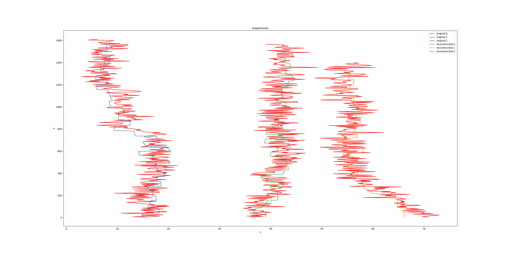

# Unsupervised Vehicle Trajectory learning in multi-lanes highway
by [Yingjie Jiang](https://www.yingjiejiang.com)

This is an adapted variaiton of [RNN-RBM](https://arxiv.org/ftp/arxiv/papers/1206/1206.6392.pdf) for unsupervised vehicle trajectory pattern learning on a multi-lanes highway. The dataset used is [US Highway 101](https://www.fhwa.dot.gov/publications/research/operations/07030/).

Unlike the original RNN-RBM, this is a model which performs well for real-valued dataset. After training, it can memorize a given vehicle trajectories pattern on a specific route, which can be used to reconstruct vehicle trajectories based on a input dataset polluted by noise.

Training
----
Put the input trajectories dataset (eg. "trajectories-0750am-0805am.csv" of US Highway 101)  in the directory "./ngsim_data/ "

1. `python ngsim_manipulation.py`  # pretreatement of dataset

2. `python weight_initialization.py`  # pre-training of RBM Neural networks

3. `python rnn_rbm_train.py  <num_epoch>` # training,  num_epoch can be about 10

4. `python rnn_rbm_reconstruction.py ./parameter_checkpoints/<fichier .ckpt>`  # reconstruction of trajectories

The output picture is stocked in "./picture_folder".

There are different versions of ngsim_manipulation, as well as for rnn_rbm, RBM, draw, they deal with different situations. For using them, rename them(delete the version notation).

----
One demonstration of noise reduction:

The red lines are noised trajectories, and the lines with other colors are reconstructed trajectories by RNN-RBM.
